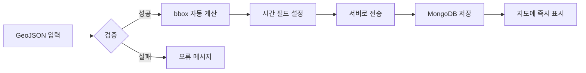

# 영토 관리 시스템 사용 가이드

## 📋 개요
`territory_manager.html`은 영토 폴리곤을 자동으로 추가하는 웹 기반 도구입니다.  
**반복되는 bbox, start_year, end_year 필드 누락 문제를 완전히 해결**합니다.

## 🚀 빠른 시작

### 1. 접속 방법
- **로컬**: `http://localhost:3000/territory_manager.html`
- **프로덕션**: `https://your-domain.vercel.app/territory_manager.html`

### 2. 인증 토큰 입력
1. 먼저 `login.html`에서 관리자 계정으로 로그인
2. 브라우저 개발자 도구(F12) → Console → `localStorage.getItem('authToken')` 복사
3. Territory Manager에서 "JWT 토큰" 필드에 붙여넣기

## 🎯 사용 방법

### 방법 1: GeoJSON 직접 입력
```json
{
  "type": "Feature",
  "properties": {
    "name": "라오스",
    "name_en": "Laos",
    "type": "admin_area",
    "admin_level": 2
  },
  "geometry": {
    "type": "Polygon",
    "coordinates": [[[100.0, 20.0], [105.0, 20.0], [105.0, 15.0], [100.0, 15.0], [100.0, 20.0]]]
  }
}
```

### 방법 2: OpenStreetMap ID
1. [OpenStreetMap](https://www.openstreetmap.org/)에서 원하는 지역 검색
2. 관계(Relation) ID 확인 (예: `49903` = 라오스)
3. Territory Manager에서 **"OSM Relation ID"** 필드에 입력
4. "OSM에서 가져오기" 클릭

**주요 OSM Relation ID**:
- 라오스: `49903`
- 몽골: `161033`
- 카자흐스탄: `214665`
- 키르기스스탄: `178009`
- 우즈베키스탄: `196240`

### 방법 3: 외부 GeoJSON URL
```
https://raw.githubusercontent.com/datasets/geo-boundaries-world-110m/master/countries.geojson
```

## ✅ 자동 처리 항목

시스템이 **자동으로 처리**하는 필드들:

| 필드 | 자동 처리 내용 |
|------|----------------|
| `bbox` | Geometry로부터 자동 계산 `[minLon, minLat, maxLon, maxLat]` |
| `start_year` | 기본값 `-3000` (모든 시대에 표시) |
| `end_year` | 기본값 `3000` (모든 시대에 표시) |
| `start` | `start_year`와 동기화 |
| `end` | `end_year`와 동기화 |
| `type` | 기본값 `admin_area` |
| `admin_level` | 기본값 `2` |

## 📊 처리 순서



## 🔧 고급 옵션

### 시간 범위 커스터마이징
기본값(-3000~3000)이 아닌 특정 시대만 표시하려면:
```json
{
  "name": "고구려",
  "start_year": -37,
  "end_year": 668
}
```

### 대량 추가 (여러 영토 동시)
GeoJSON FeatureCollection 사용:
```json
{
  "type": "FeatureCollection",
  "features": [
    { "type": "Feature", "properties": {"name": "라오스"}, "geometry": {...} },
    { "type": "Feature", "properties": {"name": "몽골"}, "geometry": {...} }
  ]
}
```

## 🐛 문제 해결

### Q: "Authentication failed" 오류
**A**: JWT 토큰이 만료되었거나 잘못되었습니다.
1. `login.html`에서 다시 로그인
2. 새 토큰 복사하여 입력

### Q: "bbox 계산 실패" 오류
**A**: Geometry 데이터가 잘못되었습니다.
1. GeoJSON이 유효한지 [geojson.io](https://geojson.io/)에서 확인
2. `geometry.coordinates` 필드가 올바른지 확인

### Q: "영토가 지도에 안보임"
**A**: 브라우저 캐시 문제일 수 있습니다.
1. `index.html`에서 Ctrl+F5 (강력 새로고침)
2. 개발자 도구 → Network → "Disable cache" 체크

## 📝 기술 상세

### Server-side 검증 (server.js)
```javascript
// POST /api/territories
// 자동으로 처리:
// 1. bbox 계산 (calculateBBoxFromGeometry)
// 2. start_year/end_year 기본값 설정
// 3. 필수 필드 검증
// 4. MongoDB 인덱스 업데이트
```

### Client-side 기능 (territory_manager.html)
- OSM Nominatim API 통합
- Fetch API로 외부 GeoJSON 로드
- 실시간 검증 및 미리보기
- JSON 다운로드 (백업용)

## 🎉 성공 사례

**Before (수동 작업)**:
```javascript
// 1. OSM에서 GeoJSON 다운로드
// 2. bbox 직접 계산
// 3. start_year, end_year 추가
// 4. MongoDB 스크립트 작성
// 5. 실행 후 오류 → 다시 1번부터
```

**After (자동화)**:
```
1. OSM ID 입력 (49903)
2. "OSM에서 가져오기" 클릭
3. 끝! ✅
```

## 📚 참고 자료

- [OpenStreetMap Nominatim API](https://nominatim.openstreetmap.org/ui/search.html)
- [GeoJSON Specification](https://geojson.org/)
- [MongoDB Geospatial Queries](https://www.mongodb.com/docs/manual/geospatial-queries/)

---

**문제가 계속되면**: GitHub Issues에 보고하거나 `DEBUG_GUIDE.md` 참조
